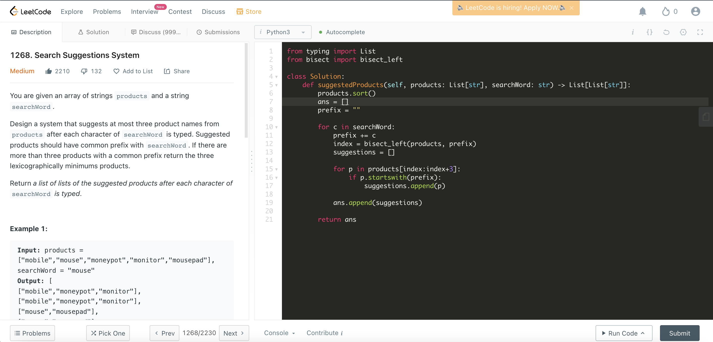

# [1268. Search Suggestions System](https://leetcode.com/problems/reorder-data-in-log-files/)



```python
from typing import List
from bisect import bisect_left

class Solution:
    def suggestedProducts(self, products: List[str], searchWord: str) -> List[List[str]]:
        products.sort()
        ans = []
        prefix = ""
        
        for c in searchWord:
            prefix += c
            index = bisect_left(products, prefix)
            suggestions = []
            
            for p in products[index:index+3]:
                if p.startswith(prefix):
                    suggestions.append(p)
        
            ans.append(suggestions)
        
        return ans
```

# Approach: Binary Search

## Intuition


