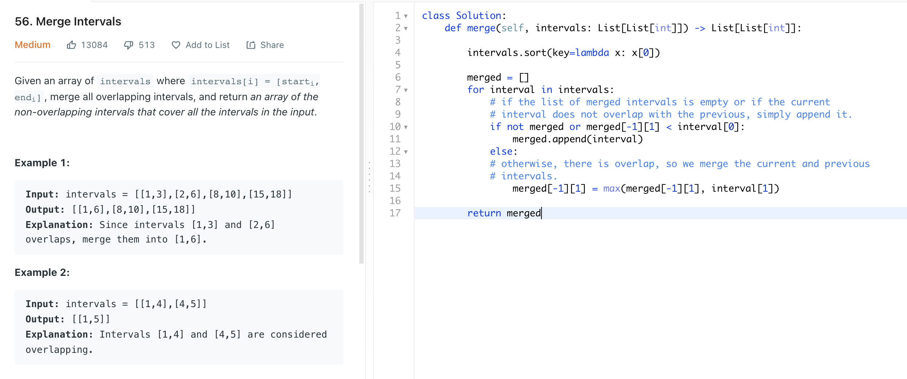

# [56. Merge Intervals](https://leetcode.com/problems/merge-intervals/)



```python
from typing import List

class Solution:
    def merge(self, intervals: List[List[int]]) -> List[List[int]]:

        intervals.sort(key=lambda x: x[0])

        merged = []
        for interval in intervals:
            # if the list of merged intervals is empty or if the current
            # interval does not overlap with the previous, simply append it.
            if not merged or merged[-1][1] < interval[0]:
                merged.append(interval)
            else:
            # otherwise, there is overlap, so we merge the current and previous
            # intervals.
                merged[-1][1] = max(merged[-1][1], interval[1])

        return merged
```

# Approach: Sorting

## Intuition

* Time complexity: `O(NlogN)`

Other than the sort invocation, we do a simple linear scan of the list, so the runtime is dominated by the `O(NlogN)` complexity of sorting.

* Space complexity : `O(logN)` or `O(N)`

If we can sort intervals in place, we do not need more than constant additional space, although the sorting itself takes `O(logN)` space. Otherwise, we must allocate linear space to store a copy of intervals and sort that.
