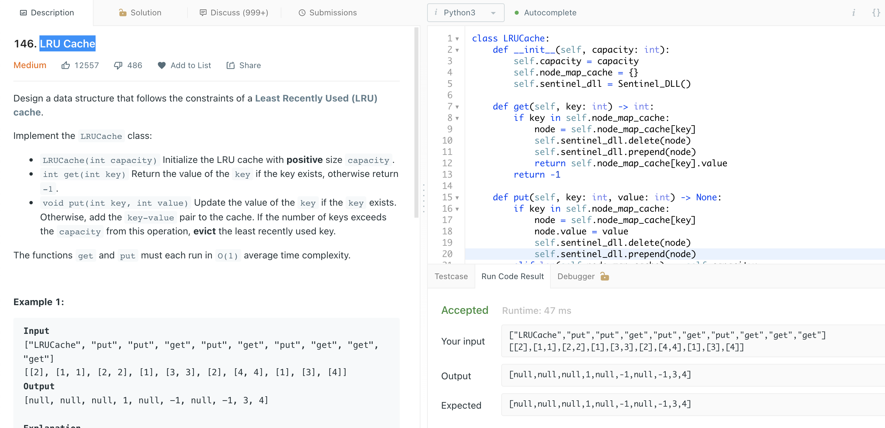

# [LRU Cache](https://leetcode.com/problems/lru-cache/)



```python
# Optimal Solution O(1) time
# https://www.youtube.com/watch?v=S6IfqDXWa10
# https://www.youtube.com/watch?v=NDpwj0VWz1U
class LRUCache:
    def __init__(self, capacity: int):
        self.capacity = capacity
        self.node_map_cache = {}
        self.sentinel_dll = Sentinel_DLL()
    
    def get_node(self, key: int) -> Node:
        if key in self.node_map_cache:
            node = self.node_map_cache[key]
            self.sentinel_dll.delete(node)
            self.sentinel_dll.prepend(node)
            return self.node_map_cache[key]
        return None
        
    def get(self, key: int) -> int:
        node = self.get_node(key)
        if node:
            return node.value
        return -1
        
    def put(self, key: int, value: int) -> None:
        node = self.get_node(key)
        if node:
            node.value = value
        else:
            if len(self.node_map_cache) == self.capacity:
                evicted = self.sentinel_dll.pop()
                del self.node_map_cache[evicted]

            node = Node(key, value)
            self.sentinel_dll.prepend(node)
            self.node_map_cache[key] = node

class Node:
    def __init__(self, key=None, value=None):
        self.value = value  
        self.key = key
        self.next = None  
        self.prev = None  

# Class for a circular, doubly linked list with a sentinel.
class Sentinel_DLL:
    # Create the sentinel node, which is before the first node
    # and after the last node.
    def __init__(self):
        self.sentinel = Node()
        self.sentinel.next = self.sentinel
        self.sentinel.prev = self.sentinel

    # Insert a new node with data after node.
    def insert_after(self, node, new_node):
        # Fix up the links in the new node.
        new_node.prev = node
        new_node.next = node.next

        # The new node follows node.
        node.next = new_node

        # And it's the previous node of its next node.
        new_node.next.prev = new_node

    # Insert a new node at the end of the list.
    def append(self, new_node):
        last_node = self.sentinel.prev
        self.insert_after(last_node, new_node)

    def pop(self):
        last_node = self.sentinel.prev
        key = last_node.key
        self.delete(last_node)
        return key

    # Insert a new node at the start of the list.
    def prepend(self, new_node):
        self.insert_after(self.sentinel, new_node)

    # Delete node from the list.
    def delete(self, node):
        # Splice out node by making its next and previous
        # reference each other.
        node.prev.next = node.next
        node.next.prev = node.prev       
```

## Approach 2: Ordered dictionary

We're asked to implement the structure which provides the following operations in O(1) time :

* Get the key / Check if the key exists
* Put the key
* Delete the first added key

The first two operations in O(1) time are provided by the standard hashmap, and the last one - by linked list.

> There is a structure called **ordered dictionary**, it combines behind both hashmap and linked list. In Python this structure is called **OrderedDict** and in Java **LinkedHashMap**.

```python
# Simpler Solution
# https://docs.python.org/3/library/collections.html
from collections import OrderedDict
class LRUCache(OrderedDict):
    def __init__(self, capacity):
        self.capacity = capacity

    def get(self, key):
        if key not in self:
            return - 1
        
        self.move_to_end(key)
        return self[key]

    def put(self, key, value):
        if key in self:
            # The item is moved to the right end if last is true (the default) or to the beginning if last is false
            self.move_to_end(key)
        self[key] = value
        if len(self) > self.capacity:
            # The pairs are returned in LIFO order if last is true or FIFO order if false
            self.popitem(last=False)

# Your LRUCache object will be instantiated and called as such:
# obj = LRUCache(capacity)
# param_1 = obj.get(key)
# obj.put(key,value)
```