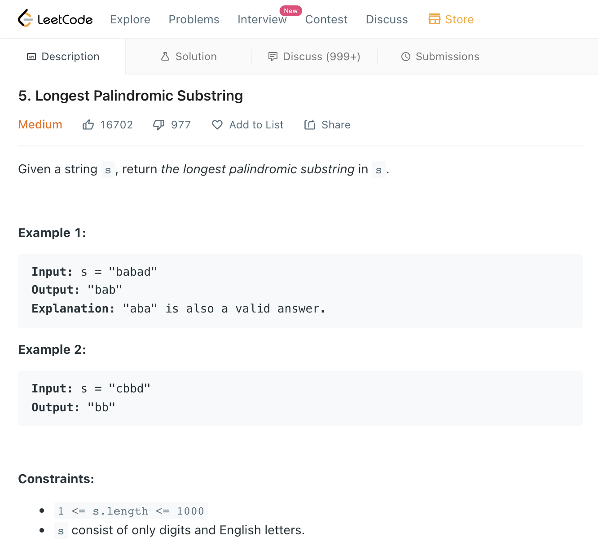

# [Longest Palindromic Substring](https://leetcode.com/explore/interview/card/microsoft/30/array-and-strings/180/)



```python
# Naive Solution: O(nˆ3) ... OMG... Oh Noooo!!!!
class Solution:
    def longestPalindrome(self, s: str) -> str:
        max_length = 0
        max_subs = None
        for i, _ in enumerate(s):
            for j in range(i, len(s) + 1):
                curr_subs = s[i:j]
                if curr_subs == curr_subs[::-1] and len(curr_subs) > max_length:
                    max_length = len(curr_subs)
                    max_subs = curr_subs
                
        return max_subs
```

```python
# Optimal Solution: O(nˆ2) ... Using Dynamic Programming
# https://www.youtube.com/watch?v=UflHuQj6MVA
class Solution:
    def longestPalindrome(self, s: str) -> str:
        if len(s) < 2:
            return s
        
        longest_palindrome = None
        P = [[i==j for i in range(len(s))] for j in range(len(s))]
        
        for distance in range(1, len(s)):
            for start in range(0, len(s) - distance):
                end = start + distance

                if s[start] == s[end] and distance == 1:
                    P[start][end] = True
                    longest_palindrome = s[start:end + 1]
                    continue
                elif distance == 1 and s[start] != s[end] and not longest_palindrome:
                    longest_palindrome = s[start]
                    continue

                if s[start] == s[end] and P[start+1][end-1]:
                    P[start][end] = True
                    longest_palindrome = s[start:end+1]
        return longest_palindrome         
```


