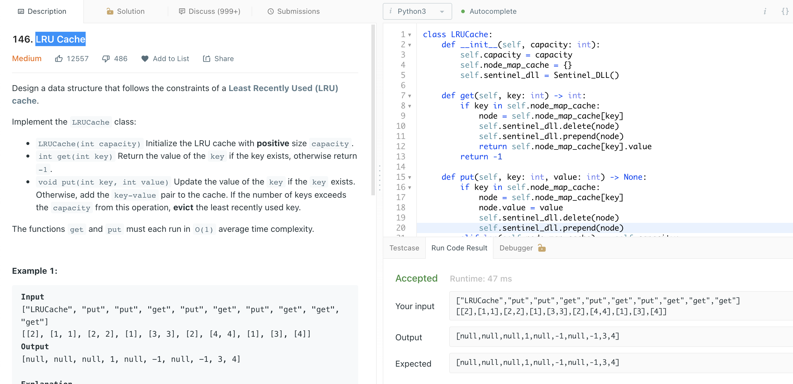

# [LRU Cache](https://leetcode.com/problems/lru-cache/)



```python
import collections

class Solution:
    def numIslands(self, grid: List[List[str]]) -> int:
        if not grid:
            return 0
        
        rows, cols = len(grid), len(grid[0])
        visit = set()
        islands = 0
        
        
        def bfs(r, c):
            q = collections.deque()
            visit.add((r,c))
            q.append((r, c))
            
            while q:
                row, col = q.popleft()
                directions = [[1, 0], [-1, 0], [0, 1], [0, -1]]
                
                for dr, dc in directions:
                    r, c = row + dr, col + dc
                    if(r in range(rows) and
                      c in range(cols) and
                      grid[r][c] == "1" and
                      (r, c) not in visit):
                        q.append((r, c))
                        visit.add((r,c))
        
        for r in range(rows):
            for c in range(cols):
                if grid[r][c] == "1" and (r, c) not in visit:
                    bfs(r, c)
                    islands +=1
        return islands
        
```

```python
from collections import OrderedDict
from typing import List, Tuple

class Island:
        lands: List[Tuple[int, int]] = []
    
        def add_land(self, land: Tuple):
            self.lands.append(land)
            
class Solution:
    def __init__(self):
        self.islands = []
        self.ordered_lands = OrderedDict()
    
    def numIslands(self, grid: List[List[str]]) -> int:
        
        num_lines = len(grid)
        num_cols = len(grid[0])
        
        for lat in range(num_lines):
            for long in range(num_cols):
                if grid[lat][long] == "1":
                    self.ordered_lands[(lat, long)] = None
        
        while len(self.ordered_lands) > 0:
            print("comecouuu")
            print(len(self.ordered_lands))
            start_land = next(iter(self.ordered_lands))
            island = Island()
            self.islands.append(island)
            print(len(self.islands))
            print("start_land: {}".format(start_land))
            self.build_island(start_land, island)
            del self.ordered_lands[start_land]
            
        print("number of islands:{}".format(len(self.islands)))
        return len(self.islands)
            
    def build_island(self, start_land, island):
        island.add_land(start_land)
        left_latlong = (start_land[0], start_land[1] + 1)
        down_latlong = (start_land[0] + 1, start_land[1])
        continue_left = left_latlong in self.ordered_lands
        continue_down = down_latlong in self.ordered_lands
        
        if continue_left:
            print("continue left")
            print(left_latlong)
            island.add_land(left_latlong)
            del self.ordered_lands[left_latlong]
            self.build_island(left_latlong, island)
        
        if continue_down:
            print("continue right")
            print(down_latlong)
            island.add_land(down_latlong)
            del self.ordered_lands[down_latlong]
            self.build_island(down_latlong, island)
        
        if not (continue_left and continue_down):
            print(self.ordered_lands)
            print("the end: {}".format(start_land))
            
            return
    
```