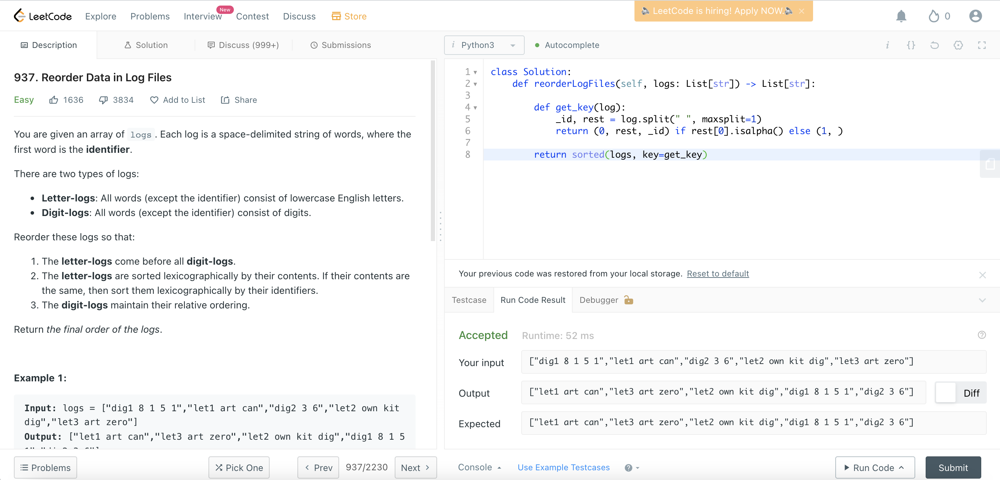

# [937. Reorder Data in Log Files](https://leetcode.com/problems/reorder-data-in-log-files/)



```python
class Solution:
    def reorderLogFiles(self, logs: List[str]) -> List[str]:

        def get_key(log):
            _id, rest = log.split(maxsplit=1)
            return (0, rest, _id) if rest[0].isalpha() else (1, )

        return sorted(logs, key=get_key)  
```

# Approach: Sorting by Keys

## Intuition

Rather than defining pairwise relationships among all elements in a collection, the order of the elements can also be defined with **sorting keys**.

To illustrate the idea, let us first define a Student object as follows, which has three properties: **name**, **grade**, **age**.

```python
class Student:
    def __init__(self, name, grade, age):
        self.name = name
        self.grade = grade
        self.age = age

student_objects = [
    Student('john', 'A', 15),
    Student('jane', 'B', 12),
    Student('dave', 'B', 10),
]
````

Now, if we are asked to sort the list of students by age in ascending order, we could simply use the age property of each student as the sorting key, as follows:

```python
>>>sorted(student_objects, key=lambda student: student.age)
[('dave', 'B', 10), ('jane', 'B', 12), ('john', 'A', 15)]
````
> Furthermore, the key could be a tuple of multiple keys, i.e. tuple(key_1, key_2, ... key_n).

If two elements have the same value on `key_1`, the comparison will carry on for the following keys, i.e. `key_2 ... key_n`.

As a result, if we are asked to sort the students first by the grade, then by the age, we can simply return the compound key `(student.grade, student.age)`, as follows:

```python
>>> sorted(student_objects, key=lambda student: (student.grade, student.age))
[('john', 'A', 15), ('dave', 'B', 10), ('jane', 'B', 12)]
```

## Algorithm

Given the above intuition, it should be clear that all we need is to *translate* the rules we defined before into a tuple of keys.

As a reminder, here are a list of the rules that we defined before, concerning the order of logs:

1. The *letter-logs* should be prioritized above all *digit-logs*.

2. Among the *letter-logs*, we should further sort them based on firstly on their **contents**, and then on their **identifiers** if the contents are identical.

3. Among the *digit-logs*, they should remain in the same order as they are in the collection.

To ensure the above order, we could define a tuple of 3 keys, `(key_1, key_2, key_3)`, as follows:

* `key_1`: this key serves as a indicator for the type of logs. For the *letter-logs*, we could assign its `key_1` with `0`, and for the *digit-logs*, we assign its `key_1` with `1`. As we can see, thanks to the assigned values, the *letter-logs* would take the priority above the *digit-logs*.

* `key_2`: for this key, we use the **content** of the *letter-logs* as its value, so that among the *letter-logs*, they would be further ordered based on their content, as required in the Rule (2).

* `key_3`: similarly with the `key_2`, this key serves to further order the letter-logs. We will use the **identifier** of the *letter-logs* as its value, so that for the *letter-logs* with the same content, we could further sort the logs based on its identifier, as required in the Rule (2).

**Note**: for the *digit-logs*, we don't need the `key_2` and `key_3`. We can simply assign the None value to these two keys. As a result, the key value for all the *digit-logs* would be `(1, None, None)`.

Finally, thanks to the **stability** of sorting algorithms, the elements with the same key value would remain the same order as in the original input. Therefore, the Rule (3) is ensured.

## Complexity Analysis

Let `N` be the number of logs in the list and `M` be the maximum length of a single log.

### Time Complexity: `O(M⋅N⋅logN)`

The `sorted()` in Python is implemented with the [Timsort](https://en.wikipedia.org/wiki/Timsort) algorithm whose time complexity is O(N⋅logN).

Since the keys of the elements are basically the logs itself, the comparison between two keys can take up to `O(M)` time.

Therefore, the overall time complexity of the algorithm is `O(M⋅N⋅logN)`.

### Space Complexity: O(M⋅N)

First, we need `O(M⋅N)` space to keep the keys for the log.

In addition, the worst space complexity of the **Timsort** algorithm is `O(N)`, assuming that the space for each element is O(1). Hence we would need `O(M⋅N)` space to hold the intermediate values for sorting.

In total, the overall space complexity of the algorithm is `O(M⋅N+M⋅N)=O(M⋅N)`.

# [Similar Problem in HackerRank](https://www.hackerrank.com/challenges/ctci-comparator-sorting/problem)

```python
from functools import cmp_to_key
class Player:
    def __init__(self, name, score):
        self.name = name
        self.score = score
    def __repr__(self):
        pass
        
    @staticmethod
    def comparator(a, b):
        if a.score > b.score:
            return -1
        if a.score < b.score:
            return 1
        if a.name > b.name:
            return 1
        if a.name < b.name:
            return -1
        return 0

n = int(input())
data = []
for i in range(n):
    name, score = input().split()
    score = int(score)
    player = Player(name, score)
    data.append(player)
    
data = sorted(data, key=cmp_to_key(Player.comparator))
for i in data:
    print(i.name, i.score)
```